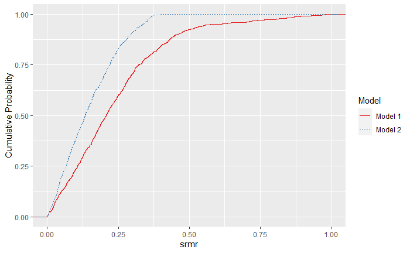
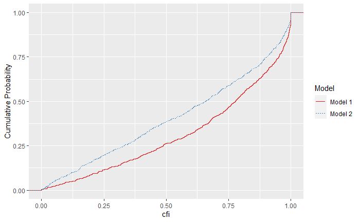

<!-- README.md is generated from README.Rmd. Please edit that file -->

# ockhamSEM

## Overview

ockhamSEM is an R package for studying the fit propensity of
single-group structural equation models with continuous items.
Underlying support is through the [lavaan](https://lavaan.ugent.be/)
package. A variety built-in graphical and text summaries are provided.

The package is introduced in Falk and Muthukrishna (2020) Parsimony in
Model Selection: Tools for Assessing Fit Propensity.

## Installation

``` r
# From GitHub:
# install.packages("devtools")
devtools::install_github("falkcarl/ggplot2")
```

## Usage

Let’s compare fit propensity for the following two models consisting of
3 variables:


### 1\. Set up a covariance matrix to fit models to:

``` r
p<-3 # number of variables
temp_mat <- diag(p) # identity matrix
colnames(temp_mat) <- rownames(temp_mat) <- paste0("V", seq(1, p))
```

### 2\. Define and fit the two models to be compared using the lavaan package:

``` r
mod1a <- 'V3 ~ V1 + V2
  V1 ~~ 0*V2'
mod2a <- 'V3 ~ V1
  V2 ~ V3'

mod1a.fit <- sem(mod1a, sample.cov=temp_mat, sample.nobs=500)
mod2a.fit <- sem(mod2a, sample.cov=temp_mat, sample.nobs=500)
```

### 3\. Run fit propensity analysis

Here we use the onion method to generate random correlation matrices and
will compare fit propensity for the SRMR and CFI fit measures.

``` r
res <- run.fitprop(mod1a.fit, mod2a.fit, fit.measure=c("srmr","cfi"),
  rmethod="onion",reps=1000)
```

Output:

    [1] "Generate matrices"
    [1] "Fitting models"

### 4\. Summarize and plot fit propensity

Summarize:

``` r
summary(res)
```

Output:

    Quantiles for each model and fit measure:
    
     Model  1 
           srmr   cfi
    0%    0.001 0.000
    10%   0.041 0.227
    20%   0.091 0.413
    30%   0.133 0.574
    40%   0.177 0.682
    50%   0.219 0.778
    60%   0.269 0.852
    70%   0.316 0.922
    80%   0.406 0.969
    90%   0.635 0.994
    100% 11.059 1.000
    
     Model  2 
          srmr   cfi
    0%   0.000 0.000
    10%  0.031 0.129
    20%  0.051 0.257
    30%  0.079 0.394
    40%  0.104 0.522
    50%  0.133 0.656
    60%  0.162 0.763
    70%  0.202 0.870
    80%  0.239 0.936
    90%  0.294 0.982
    100% 0.400 1.000
    
     Information about replications for each model and fit measure:
    
     Model  1 
    
    Mean across replications
     srmr   cfi 
    0.366 0.693 
    
    Median across replications
     srmr   cfi 
    0.219 0.778 
    
    Number of finite values
    srmr  cfi 
     999  999 
    
    Number of NA values
    srmr  cfi 
       1    1 
    
     Model  2 
    
    Mean across replications
     srmr   cfi 
    0.148 0.601 
    
    Median across replications
     srmr   cfi 
    0.133 0.656 
    
    Number of finite values
    srmr  cfi 
    1000 1000 
    
    Number of NA values
    srmr  cfi 
       0    0 
    
     Effect Sizes for Differences in Model Fit:
    
      srmr 
    
     Model 1 vs. Model 2 
       Cohen's d:           -2.386 
       Cliff's delta:       0.342 
       Komolgorov Smirnov:  0.273 
    
      cfi 
    p-value will be approximate in the presence of ties
     Model 1 vs. Model 2 
       Cohen's d:           -2.057 
       Cliff's delta:       0.168 
       Komolgorov Smirnov:  0.145 

Plot:

``` r
plot(res)
```

Output:




